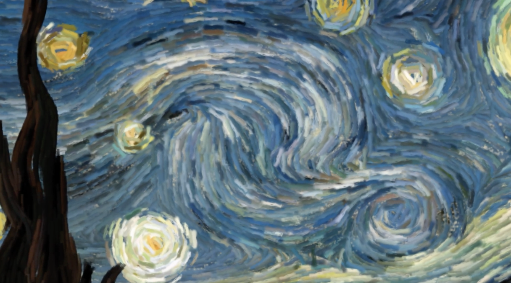
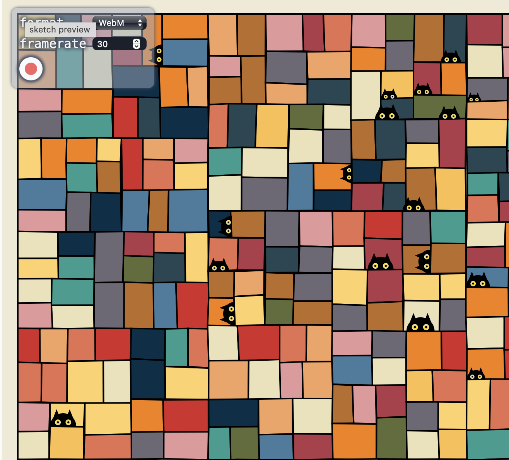

# Week 8 Design Research for major assignment

# HEADING 1

## HEADING 2

### HEADING 3
## Part 1: Imaging Technique Inspiration
The idea for the major project is inspired by the work of Petros Vrellis. I would like to animate the wheels in the artwork Fortune of Wheels for my piece, just like he animated the flows in Starry Night. In video 2, random cats appear across the grids. I plan to make the cats move along the spinning wheels. The cat will disappear when the user clicks on it, and reappear on a random wheel. It will be a simulation of a "hide and seek" game between the user and the cat.

*Image 1 - Starry Night **before** animation*

*Image 2 - Starry Night **after** animation*

[*Video 1 - Inspiration by manasvihow*](https://editor.p5js.org/manasvihow/sketches/TnI2BDD1Z)

## Part 2: Coding Technique Exploration
The coding technique is turning quads (the rectangles in the canvas) into an object and attributing "cats" as one of its properties. Thus, they can determine what happens when q.cats=null or when a cat is present at the quad. It also uses "filter" so that only a new array of all quads that has a visible cat object attached is returned. These techniques would allow me to control the number of cats, and thus when user clicks on the cat, their positions can be randomly changed.

[Link to code reference](https://editor.p5js.org/manasvihow/sketches/Uojid9ORv)
